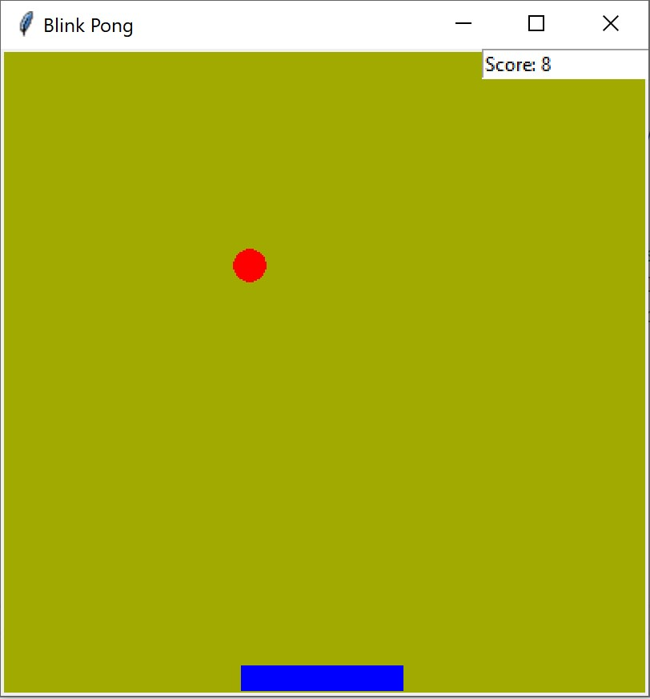
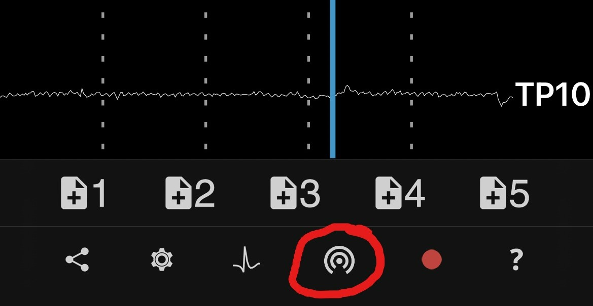

# Introduction
This is the first in a series of project where you will learn everything from how to control a very simplistic Pong game by blinking your eyes, to more advanced controlling of software or external devices with the help of a consumer-based EEG-device.

## Tutorial 1 - play Pong by blinking
In this first tutorial you will learn how to control a Pong game just by blinking your eyes. As an exception this tutorial will not use machine learning as it is intended to be a gentle introduction to the concept of human and machine communication. Later tutorials will step up and include machine learning as well.



## Prerequisites
To be able to reproduce examples found in this tutorial, you'll need:
 - A Muse EEG-device, any model should work, although Muse-01 (from 2014) streams with 220 Hz instead of 256 Hz and might require a few code changes in later tutorials. They cost around 250 USD/EUR and are manufactured by the Canadian company [Interaxon Inc.](https://choosemuse.com/) 
 -  iPhone or Android phone
 - [Mind Monitor app](https://mind-monitor.com/) for iPhone or Android, one-time price is ~15 USD/EUR
 - A computer able to run Python + WiFi
	 - only PC/Win10 tested although Mac and Linux computers are expected to work
	 - Data flow: Muse -> Bluetooth -> phone/Mind Monitor -> WiFi -> computer
 - Python 3.x
## What is EEG?
The human brain consists of billions of cells, roughly half of them are neurons, and the rest help and facilitate the activity of neurons. Neurons are densely interconnected via synapses, which act as activity gateways. Synaptic activity generates a tiny electrical impulse that can be measured on the surface of the head. 
Electroencephalography, or EEG, is the physiological method of choice to record the electrical activity generated by the brain via electrodes placed on the scalp surface. As the voltage fluctuations measured at the electrodes are very small, the recorded data is digitized and sent to an amplifier. The amplified data can then be displayed as a sequence of voltage values, often using different graphs, like spectrograms [(Farnsworth, 2021)](https://imotions.com/blog/what-is-eeg/).

Professional or clinical EEG-devices are typically equipped with between 16 to 64 high-quality electrodes, and the cost is ~800 - 3000+ USD/EUR. They are mostly intended for research and clinical usage. Consumer-based devices on the other hand only have a few electrodes, but are much more affordable and are often also easier to use. Their main focus is on meditation and relaxation, but can with some limitations also be used for research (more about this in my [Master's thesis](https://urn.fi/URN:NBN:fi:amk-2022090219806)). 

Muse EEG-devices have four EEG-electrodes, two at the forehead, and two behind the ears. In addition they also have an accelerometer/gyroscope, and newer models include a PPG-sensor which  measures blood flow, breathing rhytm, and heart rate. In this tutorial however are  only signals from EEG-electrodes being used.
## Preparations
**Python modules**

 - Install Python-OSC and Tkinter from a command prompt with 
```pip install python-osc``` and `pip install tk`

**Mind Monitor settings**

 - `OSC Stream Target IP`: here you should add your computer's local IP-address, on Win10 you can run `ipconfig` in a command prompt to find it, often starts with 192.168.x.x
 - `OSC Stream Port`: set to `5000`

**Computer**

 - You might need to allow the computer's firewall to allow traffic through port 5000.

## Blink Pong game
**Installation**

 - Download the Python [code](https://github.com/baljo/Muse-EEG/blob/main/Blink%20Pong%20without%20ML.py)
 - Run the game from your favourite IDE or from the command prompt with `python Blink Pong without ML.py`

**Usage**

 - Connect the Muse EEG-device to your phone
 - Start streaming from Mind Monitor by clicking on the button showed in the picture
 

